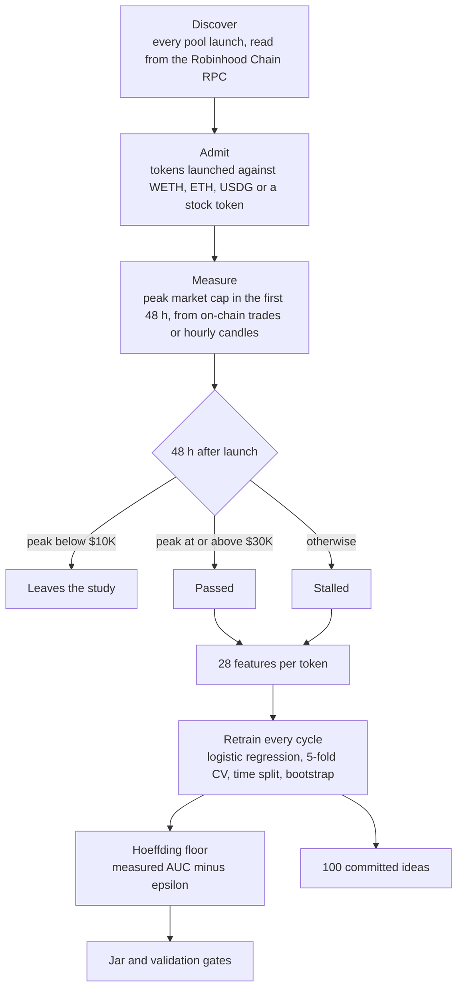

# Wassily

**An autonomous survival agent for Robinhood Chain tokens that only believes what it can prove.**
https://x.com/WassilyAgent
<p align="center">
  
</p>

Wassily reads every token launch on Robinhood Chain straight from the chain, keeps the ones that clear **$10K peak market cap** and learns which go on to reach **$30K**. It never trusts its raw score. It fills a jar only with a **proven floor**: the measured AUC minus the penalty given by **Hoeffding's inequality**. On a thin sample the penalty is large and the jar stays empty, by design.

<<<<<<< HEAD
**Live site:** https://wassily-feed-production.up.railway.app<br>
**X:** [@WassilyAgent](https://x.com/WassilyAgent)
=======
**Live site:** https://www.wassily.tech/
**Demo Site :** https://wassily-feed-production.up.railway.app

>>>>>>> 54580559b745a2828f66f4dc02af63d75a447048

> Wassily is a mascot, not a financial adviser. It measures survival, not price. Nothing is ever deployed or traded automatically.

---

## Meet Wassily

Wassily is named in honour of **Wassily Hoeffding (1914–1991)**. He was born in what was then the Grand Duchy of Finland, trained in Berlin, and later became a professor at Chapel Hill.
- **1948:** he described **U-statistics**, the family the AUC belongs to.
- **1963:** he proved how fast an average of bounded random variables settles near its expectation. The chance that it strays by *t* shrinks like exp(−2nt²).

Every launch on Robinhood Chain is a coin of unknown bias. One flip says nothing, but thousands say a lot, and Hoeffding tells you exactly how much. Wassily keeps flipping, writes every result down, and refuses to believe the average until it has nowhere left to hide.


---

## How it works




1. **Discover.** Every block is read from the Robinhood Chain RPC for pool launches: Uniswap v2 `PairCreated`, v3 `PoolCreated`, v4 `Initialize`, and the Pons launchpad's curve creation.
   - A launch counts when the token is paired against a quote asset (WETH, ETH, USDG or a tokenized stock).
   - An existing token that merely opens a new pool is not a launch.
2. **Measure.** 48 hours after launch, the token's **peak** market cap is its highest price over those 48 hours times its total supply. A token that touched $25K and fell back still crossed $10K.
   - **Pons launchpad tokens** (most launches): every trade on the bonding curve is read from the chain, priced as quote paid ÷ tokens moved, in USD at that hour. This matches GeckoTerminal's candles to within half a percent.
   - **Other venues:** the highest hourly candle from GeckoTerminal for the pools DexScreener lists.
3. **Label.** Each token is labelled once:
   - peak below $10K: it leaves the study;
   - peak at or above $30K: *passed*;
   - anything in between: *stalled*.

   Its holder count **one hour after launch** is replayed from its ERC-20 `Transfer` events. That is long before the 48-hour outcome is known, so the feature cannot simply echo a pump that already happened. A token whose count is still being replayed stays out of training rather than getting a guessed value.
4. **Backfill.** On first start the last 14 days of launches are labelled the same way, newest first, as a uniform 50% random sample (`BACKFILL_DAYS`, `BACKFILL_SAMPLE`), so the study starts with real history instead of an empty jar. New launches are all checked.
5. **Learn.** Every cycle (hourly in live mode) Wassily fits a class-balanced, L2-regularised logistic regression by Newton's method (IRLS). It then checks the fit three ways:
   - 5-fold cross-validation;
   - a train-on-past, test-on-future split;
   - 500 bootstrap resamples of the out-of-fold predictions.
6. **Prove.** Hoeffding turns the measured AUC into a floor (see [The math](#the-math)).
7. **Fill.** The jar reads only from the floor, and is capped until four validation gates pass.
8. **Write ideas.** Wassily writes and commits 100 ranked token-name ideas (see [Ideas](#ideas-wassily-writes)).

### What Wassily looks at (d = 28)

| Family | Columns |
|---|---|
| Launch hour | 2 (sine and cosine) |
| Day of week | 7 |
| Holder count, taken once 1 h after launch | 1 |
| Text shape: lore length, missing-lore flag, words in the name | 3 |
| Lore words, hashed into buckets | 15 (zero on live data, see below) |

Nothing derived from price, volume or liquidity is ever a feature. A token's description cannot be observed for past launches, so on live data the lore columns stay zero and no token trains on its lore.

---

## The math

The measured AUC Â is a two-sample U-statistic, so Hoeffding's inequality applies with the smaller class as the effective sample size:

```math
\Pr\big(\hat{A} - A \le -t\big) \le e^{-2mt^{2}}, \qquad m = \min(n_{+},\, n_{-})
```

Set the right-hand side to δ = 0.05 to get the penalty ε and the floor. With 95% confidence the true AUC is at least the floor:

```math
\varepsilon = \sqrt{\frac{\ln(1/\delta)}{2m}}, \qquad \text{floor} = \hat{A} - \varepsilon
```

The jar fills from the floor, never from Â:

```math
\text{jar} = \min\!\left(1,\ \max\!\left(0,\ \frac{\text{floor} - 0.50}{0.60 - 0.50}\right)\right)
```


**Worked example.** Take a measured AUC of 0.65. Survivors are the smaller class, so *m* is the number of survivors:

| Survivors *m* | ε | Floor | Jar |
|---|---|---|---|
| 100 | 0.122 | 0.528 | 28% |
| 200 | 0.087 | 0.563 | 63% |
| 600 | 0.050 | 0.600 | full* |
| 1,000 | 0.039 | 0.611 | full* |

\*Only once every gate below passes. Until then the jar stops at 95%.

The same model looks very different on less evidence. At AUC 0.62 with 100 survivors, the floor is 0.498 and the jar is empty.

### Validation gates

| Gate | Threshold | Why it matters |
|---|---|---|
| Sample size | n ≥ 2,000 labelled tokens | Enough data for the folds to mean something |
| Survivors | n₊ ≥ 200 | The bound runs on the smaller class |
| Fold stability | σ of fold AUCs < 0.05 | One lucky fold cannot carry the score |
| Time split | gap ≤ 0.04 | What worked on older tokens must still work on newer ones |


---

## Ideas Wassily writes

On every retrain, Wassily writes token-name ideas in its own vocabulary and ranks the top 100 with the current model. The **Brain** page publishes them.

1. **Replayable.** The cycle is seeded by sha256 of the run id, so anyone holding the model can reproduce it.
2. **Filtered before scoring.** The filter runs first, so it cannot shape the ranking. It rejects:
   - real people's names;
   - promises of returns, yield or price;
   - impersonation of existing tickers;
   - names already deployed on chain.
3. **Fair scoring.** Holders are pinned at the dataset median, so only the name, lore and launch hour move the score.
4. **Committed before display.**
   - Each idea is hashed with sha256 over its name, lore, hour and run id.
   - The hash is appended to `data/commitments.jsonl` before the cycle can be served.
   - The Brain page re-verifies every hash in your browser.
5. **Theft record.** If another address later deploys a name Wassily committed, the deployment is recorded with its time gap, and the name is excluded from future cycles.

Ideas are published for transparency. Wassily does not deploy them.


---

## Honest by default

- **Source labels.**
  - **LIVE** appears only while the server ingests real tokens.
  - A simulated market is labelled **SIMULATED**.
  - Pages say **Connecting…** until the server answers.
- **Real history, never invented.** The backfill labels past launches from the chain and their actual trades. Nothing is seeded or adjusted by hand.
- **Warming up.**
  - While the backfill runs, the jar card shows how far back it has reached.
  - Until real labels exist, AUC, floor and model weights read "—".
  - The jar shows `labelled / 2,000`, the tokens being watched, and a countdown to the next label.
- **Real logos only.** Token icons are the ones teams published on DexScreener or GeckoTerminal. A token without one keeps an empty slot; Wassily never draws one.
- **Open data.** Every number is computed. Download `/api/dataset.csv` and `/api/methodology.json` to check the work.


**Known limits** (also stated in `methodology.json`):
- **Sampled history.** The backfill looks up a random half of past launches. The sample is uniform by address, so it is unbiased, but smaller than a census. Non-Pons venues are paced by GeckoTerminal's free tier, so that part of the backfill finishes later.
- **Resolution.** Pons peaks use every trade; other venues use hourly candles, so a spike inside an hour counts at that hour's high.
- **Unusual quote assets.** A token launched only against a rarely used quote asset may be missed.
- **No lore.** Descriptions are not on-chain, so lore is not a live feature.

---

## Why Hoeffding

AUC is a U-statistic, so Hoeffding gives a floor that is **distribution-free**: it assumes nothing about how outcomes are distributed. The jar also fills at a believable pace. A VC-dimension bound, by comparison, needs tens of thousands of tokens before the jar moves.

The **Formula Lab** (`/lab`) puts Hoeffding next to eight other bounds on the same evidence. With n tokens, n₊ survivors, n₋ = n − n₊, measured AUC A and δ = 0.05:

| Bound | Formula | Guarantee |
|---|---|---|
| **Hoeffding (Wassily)** | ε = √(ln(1/δ) / 2·min(n₊, n₋)) | distribution-free |
| Bernstein | ε = √(2σ² ln(1/δ)/m) + 2 ln(1/δ)/3m, σ² = A(1−A) | distribution-free, variance-aware |
| DKW | ε = √(ln(4/δ)/2n₊) + √(ln(4/δ)/2n₋) | distribution-free |
| VC | ε = √((d(ln(2n/d)+1) + ln(4/δ)) / n) | distribution-free, very loose |
| VC + bootstrap | floor = min(A − ε_VC, bootstrap 2.5th percentile) | stricter of the two |
| Bootstrap | floor = 2.5th percentile of resampled AUCs | empirical |
| Wilcoxon | ε = z₁₋δ · SE (Hanley–McNeil) | normal approximation |
| Cantelli | ε = SE · √((1−δ)/δ) | finite variance only |
| Bayes | floor = δ-quantile of Beta(kA+1, k(1−A)+1) | posterior, uniform prior |

---

## Pages

- **Overview `/`**
  - Key numbers and the hero video with the LIVE badge.
  - The jar, or its warming-up progress.
  - The live token feed with real logos.
  - Validation gates and feature weights.
  - The proof panel.
- **Console `/console`:** uptime, the cycle countdown, the learning pipeline, survival by launch hour, and lore words ranked by survival lift.
- **Brain `/brain`:** the 100 committed ideas per cycle, in-browser sha256 verification, the generator's real source, and the revised-out and theft records.
- **Formula Lab `/lab`:** evidence sliders, a floor-versus-n chart, and the bound comparison.
- **Trade Bot `/bot` (coming soon):** the draft trading rules and a dry run of them on watched tokens, with a per-token analysis. No wallet, no orders.
- **About `/about`:** disclaimer, methodology, `dataset.csv` and `methodology.json`.

## API

All routes are read-only and same-origin.

| Route | Returns |
|---|---|
| `GET /api/health` | Source, token count, warm-up and chain ingest stats |
| `GET /api/state` | Counters, warm-up, backfill progress, findings, the latest model (AUC, σ, gates, floor, jar) and the 400 newest tokens |
| `GET /api/stream` | Server-Sent Events: `{token, counters}` per token, `{model, counters}` per retrain |
| `GET /api/model/history?days=30` | Model runs over time |
| `GET /api/dataset.csv` · `GET /api/methodology.json` | Open data |
| `GET /api/ideas/current` · `/cycle/[id]` · `/eliminated` · `/exclusions` · `/commitments?from=&to=` · `/generator` · `/filter` | Idea cycles |
| `GET /api/bootstrap?n=&npos=&auc=` | Bootstrap floor for the proof-panel sliders |

---

## Run it

```bash
npm install
npm run dev          # simulated market                  → http://localhost:3000
npm run dev:live     # real Robinhood Chain launches, read on-chain
npm test             # 61 tests: math, calibration, engine, route handlers, SSE, chain ingest
npm run build        # tsc --noEmit + next build
npm start            # production server (npm run start:live for real data)
```

It runs as **one Next.js application**: the pages, the API and the ingest loop all live in the same long-running process. The agent starts with the server (`src/instrumentation.ts`). Browsers load one snapshot from `/api/state`, then follow updates over Server-Sent Events.

**Stack:** Next.js 16.3 · React 19.3 · Zustand 5 · Tailwind CSS 4.3 · Base UI 1.8 · TypeScript 7 · KaTeX · Vitest 5.

## Configuration

See `.env.example`.

- **Public values (`NEXT_PUBLIC_*`)** are baked in at build time:
  - `NEXT_PUBLIC_CONTRACT_ADDRESS` (blank hides the copy-address button);
  - `NEXT_PUBLIC_X_URL` (defaults to [@WassilyAgent](https://x.com/WassilyAgent)) and `NEXT_PUBLIC_GITHUB_URL`, which drive the sidebar icons and the `/x`, `/twitter` and `/github` redirects;
  - `NEXT_PUBLIC_DEFAULT_PERSONA=hoeffding` (Wassily);
  - `NEXT_PUBLIC_HERO_VIDEO` and `NEXT_PUBLIC_HERO_POSTER`, which default to the files in `public/videos/`.
- **Server values** are read at runtime:
  - `DATA_SOURCE` (`chain` for live data; `dexscreener` is an older alias);
  - `PERSONA=hoeffding`;
  - `RPC_URL`, `GECKO_API`, `GECKO_PER_MINUTE`;
  - `BACKFILL_DAYS` (default 14) and `BACKFILL_SAMPLE` (default 0.5);
  - `CYCLE_SECONDS`, `POLL_SECONDS`, `PERSIST` and `DATA_DIR`.

## Deploy

The ingest loop lives in memory, so run **exactly one instance** with a **persistent disk** mounted at `/data`. Serverless platforms will not work. The `Dockerfile` builds the app and starts it in live mode on port 3000.

- **Railway:** follow the step-by-step guide in [DEPLOY-RAILWAY.md](DEPLOY-RAILWAY.md).
- **Any Docker host:**

  ```bash
  docker build -t wassily --build-arg NEXT_PUBLIC_CONTRACT_ADDRESS=0x... .
  docker run -d --name wassily --restart unless-stopped -p 3000:3000 -v wassily-data:/data wassily
  ```

  Put it behind HTTPS, and make sure the proxy does not buffer `/api/stream`.

## Project layout

```
src/
  app/          layout, providers, pages, api/* route handlers, x|twitter|github redirects
  views/        client views for each page
  components/   shell/ overview/ analytics/ ideas/ lab/ layout/ ui/
  client/       live.ts: /api/state snapshot + /api/stream SSE into the store
  server/       runtime, agent, config, persist, serialize, chain/{rpc,abi,gecko,holders}, sources/{chain,simulated,dexscreener}
  engine/       features, model (IRLS), trainer, ideas, ledger, proof, findings, sanitize, simulator
  math/         stats, auc, bounds, sha256
  config/       site.ts (study and jar settings), personas.ts (Wassily's copy and vocabulary)
public/videos/  hero.mp4, hero-poster.jpg
data/           state.json, commitments.jsonl, chain.json (backfill progress; git-ignored)
```

## Credits

- **The name.** Wassily is named in honour of Wassily Hoeffding. The project is not affiliated with or endorsed by him, his family, or any university.
- **The idea.** The survival-jar pattern was inspired by emilelearns.run. This is an independent rewrite; no code, branding or assets were reused.
- **The data.** Launches and transfers from the Robinhood Chain RPC, prices from GeckoTerminal, token logos from DexScreener and GeckoTerminal.
- **The artwork.** The hero image and video were AI-generated for this project.

*Not financial advice. Wassily estimates whether a token that already reached $10K goes on to reach $30K. It does not predict price.*
