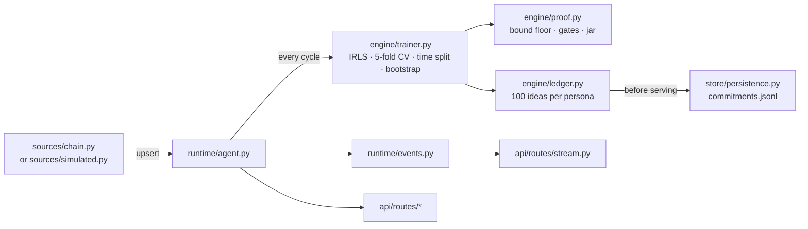

# Wassily backend (Python)

The research pipeline behind Wassily as a Python package: on-chain discovery, 48-hour labelling, IRLS training, concentration bounds, and committed idea cycles, served over a read-only HTTP API.

It speaks the same data formats as the Next.js server: `data/state.json`, `data/commitments.jsonl` and the snake_case `/api/*` JSON. Its random generator, feature map and commitment encoding are bit-exact with the TypeScript engine (see [`tests/test_parity.py`](tests/test_parity.py)), so a cycle published by either runtime can be replayed and verified by the other.

---

## Layout

```
backend/
  wassily/
    config/     site.py (study, jar and gate constants), personas.py, settings.py (env)
    maths/      stats.py (sfc32, normal, beta), auc.py (U-statistic, bootstrap), bounds.py (9 bounds), commit.py
    engine/     features.py (d = 28), model.py (IRLS), trainer.py, proof.py, ideas.py, ledger.py,
                findings.py, sanitize.py, simulator.py, types.py
    chain/      rpc.py (JSON-RPC), abi.py, gecko.py (adaptive pacing), prices.py, tokens.py, pons.py, holders.py
    sources/    simulated.py, chain.py (discovery, backfill, labelling)
    runtime/    agent.py (retrain loop, per-persona ledgers, theft records), events.py, runtime.py
    store/      persistence.py (atomic state.json, append-only commitments.jsonl)
    api/        app.py (FastAPI), serialize.py, routes/{health,state,stream,model,ideas,dataset,bootstrap}.py
    cli.py      python -m wassily <command>
  scripts/      bounds_table.py, benchmark_trainer.py, check_state_parity.py
  tests/        one file per module, plus parity vectors from the TypeScript engine
```

## Run it

Python 3.10 or newer.

```bash
cd backend
python -m venv .venv && source .venv/bin/activate      # Windows: .venv\Scripts\activate
pip install -e ".[dev]"

python -m wassily serve                      # simulated market   → http://localhost:8000/api/state
DATA_SOURCE=chain PERSIST=true python -m wassily serve   # real Robinhood Chain launches
python -m pytest -q
```

Interactive API docs are served at `/api/docs`.

## Command line

| Command | What it does |
|---|---|
| `serve [--host] [--port] [--reload]` | HTTP API plus the ingest and retrain loops |
| `simulate [--tokens N] [--bound ID ...]` | Train once on a simulated market and print ε, floor and jar for every bound |
| `train --state data/state.json` | Retrain offline from a snapshot and print the model JSON |
| `export-dataset --state … --out …` | Write the labelled training rows to CSV |
| `verify-commitments --file data/commitments.jsonl` | Re-hash every commitment; exits 1 on any mismatch |
| `replay-cycle --state … [--persona] [--cycle-id]` | Regenerate a published cycle from its run's model and compare commitments |

Scripts:

```bash
python scripts/bounds_table.py --auc 0.65 100 200 600 1000   # the README's worked example
python scripts/benchmark_trainer.py --tokens 2346            # numpy vs pure-Python IRLS
python scripts/check_state_parity.py --state ../data/state.json
```

## API

All routes are read-only.

| Route | Returns |
|---|---|
| `GET /api/health` | Source, token count, warm-up and ingest stats |
| `GET /api/state` | Counters, warm-up, backfill, findings, the latest model and the 400 newest tokens |
| `GET /api/stream` | Server-Sent Events: `{token, counters}` per token, `{model, counters}` per retrain |
| `GET /api/model/history?days=30` | Model runs over time |
| `GET /api/ideas/current` · `/cycle/{id}` · `/eliminated` · `/exclusions` · `/commitments?from=&to=` · `/generator` · `/filter` | Idea cycles (add `?persona=` for another agent) |
| `GET /api/dataset.csv` · `GET /api/methodology.json` | Open data |
| `GET /api/bootstrap?n=&npos=&auc=` | Bootstrap floor for the proof-panel sliders |

## Configuration

Same variable names as the site; see [`.env.example`](.env.example).

- `DATA_SOURCE` (`simulated` or `chain`), `CHAIN`, `PERSONA`, `BOUND`
- `CYCLE_SECONDS`, `POLL_SECONDS`
- `RPC_URL`, `GECKO_API`, `GECKO_PER_MINUTE`
- `BACKFILL_DAYS`, `BACKFILL_SAMPLE`
- `PERSIST`, `DATA_DIR`
- `HOST`, `PORT`, `CORS_ORIGINS`, `LOG_LEVEL`
- `WASSILY_PURE_PYTHON=1` forces the pure-Python IRLS path even when numpy is installed

## How the pieces fit



Training runs in a worker thread so the ingest loop and the event stream keep moving during a retrain. The live source saves its scan cursor, pending launches and backfill progress to `chain.json` after every tick, so a restart resumes where it stopped.

## Docker

```bash
docker build -t wassily-backend backend
docker run -d -p 8000:8000 -v wassily-data:/data -e DATA_SOURCE=chain -e PERSIST=true wassily-backend
```

Run exactly one instance per data directory: the agent keeps its token set in memory and owns the commitment log.
